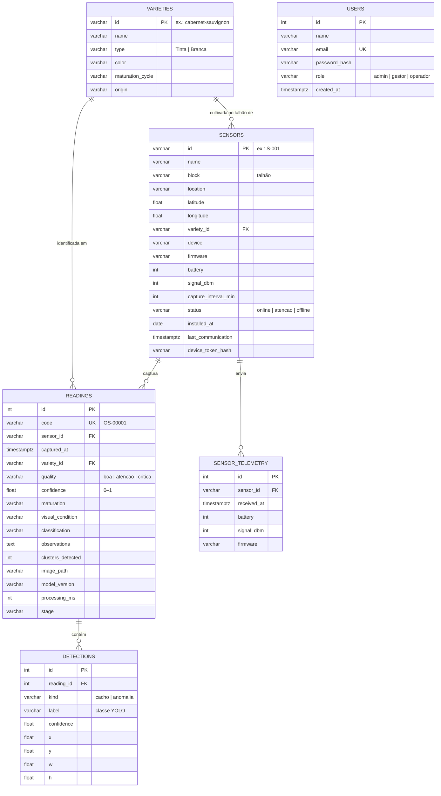

# Modelo de dados da OSAIS

A OSAIS é a **camada de dados de origem** do Projeto Integrador “Inteligência de Dados no Vale do São Francisco”. Cada imagem capturada por um sensor gera uma **leitura**, com o resultado da IA e as **detecções** (caixas) do modelo YOLO.

```
Sensor IoT → Imagem → YOLO → Classificação → Banco de dados → Histórico → Dashboard → Decisão
```

## Diagrama entidade-relacionamento



## Dicionário de dados

### `readings` — resultado de cada imagem analisada

| Coluna | Tipo | Descrição |
| --- | --- | --- |
| `code` | VARCHAR(16) | Identificador público da análise (`OS-00001`), gerado pela API |
| `sensor_id` | FK → `sensors` | Sensor que capturou a imagem |
| `captured_at` | TIMESTAMPTZ | Momento da captura (UTC; as visões convertem para `America/Recife`) |
| `variety_id` | FK → `varieties` | Variedade identificada pelo modelo |
| `quality` | `boa` · `atencao` · `critica` | Qualidade visual (Boa · Atenção · Necessita atenção) |
| `confidence` | 0–1 | Confiança do modelo na identificação |
| `maturation` | `desenvolvimento` · `pintor` · `maturacao` · `adequada` · `sobrematuracao` | Estágio de maturação |
| `visual_condition` | texto | Condição visual resumida (ex.: “Sinais de podridão”) |
| `classification` | `APROVADA` · `EM OBSERVAÇÃO` · `REVISÃO NECESSÁRIA` | Classificação geral |
| `observations` | texto | Orientação apresentada ao produtor |
| `clusters_detected` | inteiro | Cachos encontrados na imagem |
| `image_path` | texto | Caminho no armazenamento de imagens (local, S3 ou Firebase Storage) |
| `model_version` | texto | Versão do modelo, para rastreabilidade |
| `processing_ms` | inteiro | Tempo de processamento da API |
| `stage` | `recebida` · `processando` · `analisando` · `concluida` | Estado no pipeline |

### `detections` — caixas do YOLO

Coordenadas **normalizadas** (0–1): `x`, `y` = canto superior esquerdo; `w`, `h` = largura e altura. `label` segue as classes do modelo:

| Tipo | Classes |
| --- | --- |
| Cacho (variedade) | `cabernet_sauvignon`, `syrah`, `tempranillo`, `touriga_nacional`, `chenin_blanc`, `moscato_canelli` |
| Anomalia leve (Atenção) | `maturacao_desigual`, `baga_irregular`, `mancha_leve` |
| Anomalia grave (Necessita atenção) | `podridao`, `baga_murcha`, `lesao` |

## Visões

| Visão | Uso |
| --- | --- |
| `v_readings` | Leituras com sensor, variedade e data local — base de tudo |
| `v_quality_by_day` | Evolução diária por variedade (gráficos de período e evolução) |
| `v_quality_by_variety` | Histórico por variedade: total, Boa, Atenção, Necessita atenção, % Boa e confiança média |
| `v_sensor_activity` | Atividade e saúde dos sensores |
| `v_alerts` | Leituras que precisam de atenção |
| `v_dashboard_7d` | Indicadores do dashboard (últimos 7 dias) |
| `v_detections` | Detecções com contexto, para avaliar o modelo e analisar anomalias |

## Índices

- `readings (captured_at)`: filtros por período.
- `readings (sensor_id, captured_at)`: histórico individual do sensor.
- `readings (variety_id, captured_at)`: histórico por variedade.
- `readings (captured_at) WHERE quality <> 'boa'` (PostgreSQL): alertas.
- `detections (reading_id)`: carregamento das caixas de uma leitura.

## Segurança da informação e LGPD

- Senhas e tokens de dispositivo são guardados apenas como **hash PBKDF2-SHA256**.
- Os dados pessoais se limitam a nome e e-mail dos usuários; imagens do vinhedo não contêm pessoas por padrão (câmeras apontadas para os cachos).
- Em produção: usuário de banco com privilégios mínimos para a API, backups diários e TLS entre API e banco.
