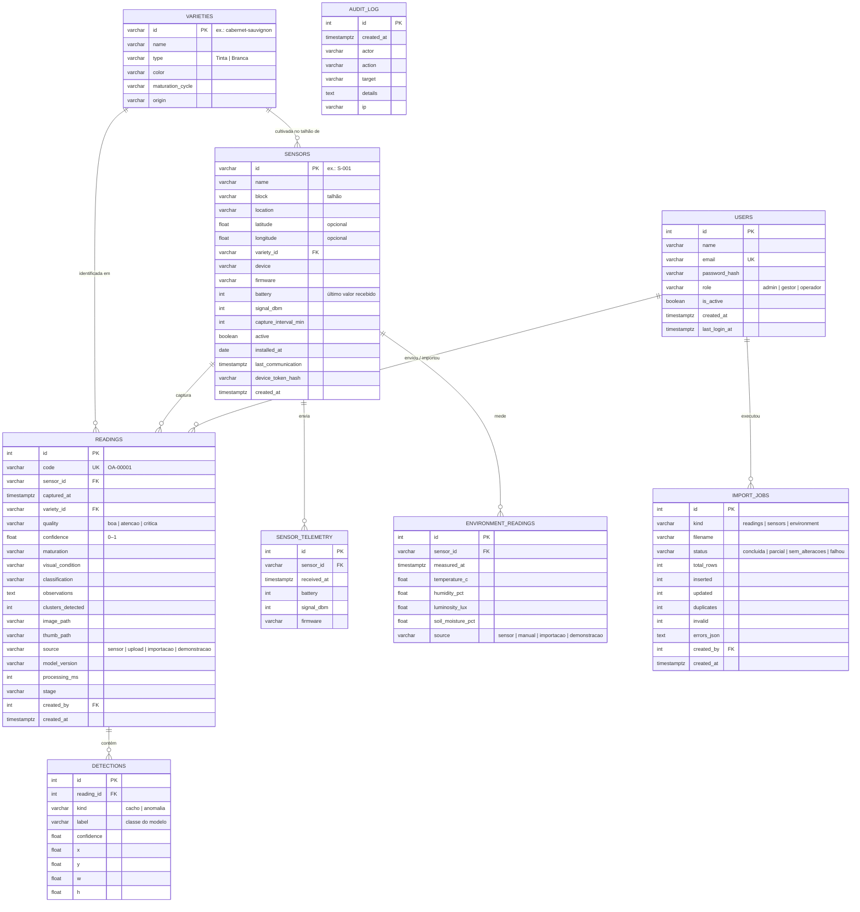

# Modelo de dados da OASIS

A OASIS é a **camada de dados de origem** do Projeto Integrador “Inteligência de Dados no Vale do São Francisco”. Cada imagem capturada por um sensor (ou enviada no painel) gera uma **leitura**, com o resultado da análise e as **detecções** (caixas). Leituras históricas e medições ambientais também podem chegar por **importação de arquivos**.

```
Sensor IoT / envio manual / importação → Validação → Análise → Classificação → Banco → Histórico → Painel → Decisão
```

## Diagrama entidade-relacionamento



## Dicionário de dados

### `sensors` — dispositivos

| Coluna | Descrição |
| --- | --- |
| `latitude` / `longitude` | Opcionais e sempre em par (restrição `ck_sensors_coords`). Sem coordenadas, o sensor não aparece no mapa; `0,0` é rejeitado pela API. |
| `battery`, `signal_dbm`, `firmware` | Últimos valores enviados pelo dispositivo (heartbeat ou envio de imagem). Ficam vazios até a primeira comunicação — nada é presumido. |
| `active` | Sensor desativado pelo administrador: não recebe imagens e aparece como “inativo”. |
| `last_communication` | Último contato do dispositivo. Base do status calculado. |
| `device_token_hash` | Hash SHA-256 do token individual (o token é mostrado uma única vez ao administrador). |

**Status calculado** (API e visão `v_sensor_status`): `inativo` se desativado; `offline` se nunca comunicou ou está sem contato há mais de 3 × o intervalo de captura (`SENSOR_OFFLINE_FACTOR`); `atencao` com bateria < 25 %, sinal ≤ −80 dBm ou atraso maior que 1,5 × o intervalo; senão `online`.

### `readings` — resultado de cada imagem analisada ou registro importado

| Coluna | Tipo | Descrição |
| --- | --- | --- |
| `code` | VARCHAR(16) | Identificador público (`OA-00001`), gerado pela API |
| `sensor_id` | FK → `sensors` | Sensor de origem. Único com `captured_at` (sem leituras duplicadas) |
| `captured_at` | TIMESTAMPTZ | Momento da captura em UTC; filtros e gráficos usam o fuso da propriedade |
| `variety_id` | FK → `varieties` | Variedade (do modelo YOLO ou do cadastro do talhão) |
| `quality` | `boa` · `atencao` · `critica` | Boa · Atenção · Necessita atenção |
| `confidence` | 0–1 | Confiança da detecção do cacho (0 quando nenhum cacho foi identificado) |
| `maturation` | `desenvolvimento` · `pintor` · `maturacao` · `adequada` · `sobrematuracao` · `nao_informada` | Estágio estimado pela cor das bagas; `nao_informada` quando não foi possível estimar ou o arquivo importado não trazia |
| `visual_condition` | texto | Condição visual resumida (ex.: “Sinais de podridão”) |
| `classification` | `APROVADA` · `EM OBSERVAÇÃO` · `REVISÃO NECESSÁRIA` | Classificação geral (coerente com `quality`) |
| `observations` | texto | Orientação apresentada ao produtor |
| `clusters_detected` | inteiro | Cachos encontrados |
| `image_path` / `thumb_path` | texto | Imagem processada (máx. 1600 px, sem EXIF) e miniatura (360 px) |
| `source` | `sensor` · `upload` · `importacao` · `demonstracao` | Origem do dado |
| `model_version` | texto | Detector que gerou o resultado (“OASIS análise de cor v1”, “YOLO · arquivo.pt”, “Importado”…) |
| `processing_ms` | inteiro | Tempo de processamento na API |
| `created_by` | FK → `users` | Usuário que enviou ou importou (nulo para dispositivos) |

### `detections` — caixas detectadas

Coordenadas **normalizadas** (0–1): `x`, `y` = canto superior esquerdo; `w`, `h` = largura e altura. `label` segue as classes do modelo:

| Tipo | Classes |
| --- | --- |
| Cacho (variedade) | `cabernet_sauvignon`, `syrah`, `tempranillo`, `touriga_nacional`, `chenin_blanc`, `moscato_canelli` |
| Anomalia leve (Atenção) | `maturacao_desigual`, `baga_irregular`, `mancha_leve` |
| Anomalia grave (Necessita atenção) | `podridao`, `baga_murcha`, `lesao` |

### `environment_readings` — medições ambientais

Temperatura (−20 a 60 °C), umidade do ar (0–100 %), luminosidade (0–200 000 lux) e umidade do solo (0–100 %), todas opcionais (ao menos uma por registro). Chegam pelo heartbeat/envio de imagem do dispositivo (DHT22), por lançamento manual na API ou por importação. Única por sensor e horário.

### `import_jobs` e `audit_log`

`import_jobs` registra cada importação (inclusive as que falharam) com contagens e os erros por linha em JSON. `audit_log` registra logins (inclusive falhos e bloqueados), criação e alteração de usuários e sensores, geração de tokens, importações e exclusões, com o IP de origem.

## Visões

| Visão | Uso |
| --- | --- |
| `v_sensor_status` | Sensores com o status calculado |
| `v_readings` | Leituras com sensor, variedade, origem e data local — base de tudo |
| `v_quality_by_day` | Evolução diária por variedade |
| `v_quality_by_variety` | Total, Boa, Atenção, Necessita atenção, % Boa e confiança média por variedade |
| `v_sensor_activity` | Atividade e saúde dos sensores |
| `v_alerts` | Leituras que precisam de atenção |
| `v_dashboard_7d` | Indicadores dos últimos 7 dias |
| `v_environment_daily` | Médias, mínimas e máximas ambientais por sensor e dia |
| `v_detections` | Detecções com contexto (avaliação do modelo e análise de anomalias) |
| `v_import_jobs` | Importações com o nome de quem executou |

## Índices

- `readings (captured_at)`, `(variety_id, captured_at)`, `(quality, captured_at)`: filtros do histórico e dos indicadores.
- `readings (sensor_id, captured_at)` — único: histórico do sensor e bloqueio de duplicados.
- `readings (captured_at) WHERE quality <> 'boa'` (PostgreSQL): alertas.
- `environment_readings (sensor_id, measured_at)` — único; `sensor_telemetry (sensor_id, received_at)`; `detections (reading_id)`; `audit_log (created_at)`.

## Segurança da informação e LGPD

- Senhas guardadas com **PBKDF2-SHA256** (240 mil iterações); tokens de dispositivo, que são aleatórios de 192 bits, com **SHA-256**. Nenhum segredo é armazenado em texto.
- Dados pessoais limitados a nome, e-mail, último acesso e IP na auditoria. As imagens do vinhedo têm os metadados EXIF (inclusive GPS) removidos antes de serem gravadas.
- Em produção: usuário de banco com privilégios mínimos para a API, backups diários, TLS entre API e banco e portas do banco expostas apenas na rede interna.
